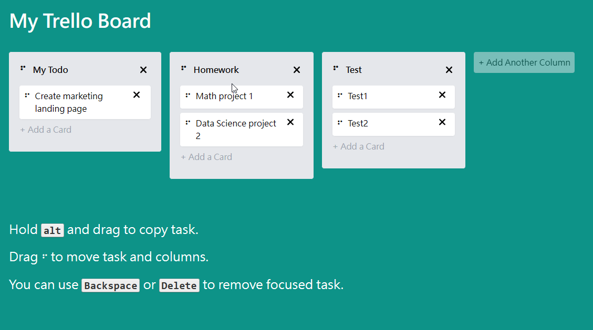

# Trello Board Clone

A modern, interactive Kanban board application built with Vue 3 and Nuxt 3, featuring drag-and-drop functionality for task and column management.

[](https://roytu-my-trello-board.netlify.app/)
[](https://nuxt.com/)
[](https://vuejs.org/)
[](https://www.typescriptlang.org/)

## 🚀 Live Demo

View the application: [https://roytu-my-trello-board.netlify.app/](https://roytu-my-trello-board.netlify.app/)



## ✨ Features

- **Drag & Drop Interface**: Intuitive task and column reordering with smooth animations
- **Task Management**: Create, edit, and delete tasks within columns
- **Column Organization**: Dynamically add and manage multiple columns
- **Keyboard Shortcuts**: Quick task deletion using `Backspace` or `Delete` keys
- **Task Duplication**: Hold `Alt` while dragging to duplicate tasks
- **Responsive Design**: Fully responsive layout built with Tailwind CSS
- **Local Storage**: Persistent data storage in the browser
- **Type-Safe**: Built with TypeScript for enhanced code quality and maintainability

## 🛠️ Tech Stack

- **Framework**: [Nuxt 3](https://nuxt.com/) - Vue 3 meta-framework
- **Language**: [TypeScript](https://www.typescriptlang.org/) - Type-safe JavaScript
- **Styling**: [Tailwind CSS](https://tailwindcss.com/) - Utility-first CSS framework
- **Drag & Drop**: [VueDraggable](https://github.com/SortableJS/vue.draggable.next) - Vue 3 compatible drag-and-drop
- **Utilities**: [VueUse](https://vueuse.org/) - Collection of Vue Composition utilities
- **ID Generation**: [nanoid](https://github.com/ai/nanoid) - Secure unique ID generator

## 📦 Installation

```bash
# Clone the repository
git clone https://github.com/yourusername/trello-board-vue.git
cd trello-board-vue

# Install dependencies (using pnpm)
pnpm install

# Or with npm
npm install

# Or with yarn
yarn install
```

## 🚀 Development

```bash
# Start development server at http://localhost:2258
pnpm dev

# Build for production
pnpm build

# Preview production build
pnpm preview

# Generate static site
pnpm generate
```

## 📁 Project Structure

```
trello-board-vue/
├── components/
│   ├── TrelloBoard.vue          # Main board container
│   ├── TrelloBoardColumn.vue    # Column component
│   ├── TrelloBoardTask.vue      # Task component
│   ├── NewTask.vue              # Task creation form
│   ├── DragHandle.vue           # Drag handle indicator
│   └── DeleteButton.vue         # Delete action button
├── types/
│   └── index.ts                 # TypeScript type definitions
├── app.vue                      # Application entry point
└── nuxt.config.ts               # Nuxt configuration
```

## 🎯 Key Features Implementation

### Drag & Drop
- Implemented using VueDraggable with smooth animations
- Supports both task and column reordering
- Visual feedback during drag operations

### Task Management
- Create new tasks within any column
- Delete tasks using delete button or keyboard shortcuts
- Duplicate tasks by holding `Alt` key while dragging

### Data Persistence
- Automatic saving to browser's local storage
- State restoration on page reload

## 🎨 UI/UX Highlights

- Clean, modern interface inspired by Trello
- Smooth animations for all interactions
- Accessible keyboard navigation
- Visual drag handles for intuitive interaction
- Responsive grid layout adapting to screen sizes

## 📝 License

This project is open source and available under the MIT License.

## 👤 Author

**Roy Tu**

- GitHub: [@Roy-Tu](https://github.com/Roy-Tu)
- Project Link: [https://github.com/Roy-Tu/trello-board-vue](https://github.com/Roy-Tu/trello-board-vue)

## 🙏 Acknowledgments

- Inspired by [Trello](https://trello.com/)
- Built with [Nuxt 3](https://nuxt.com/) framework
- Deployed on [Netlify](https://www.netlify.com/)
